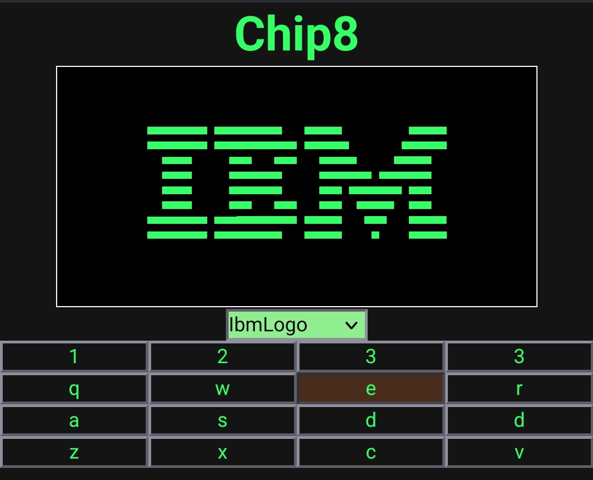
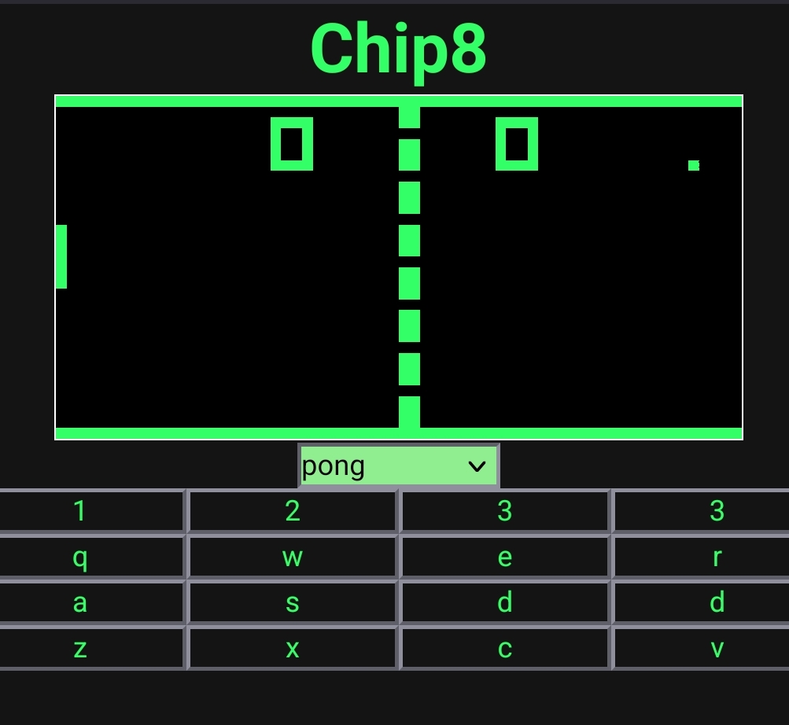
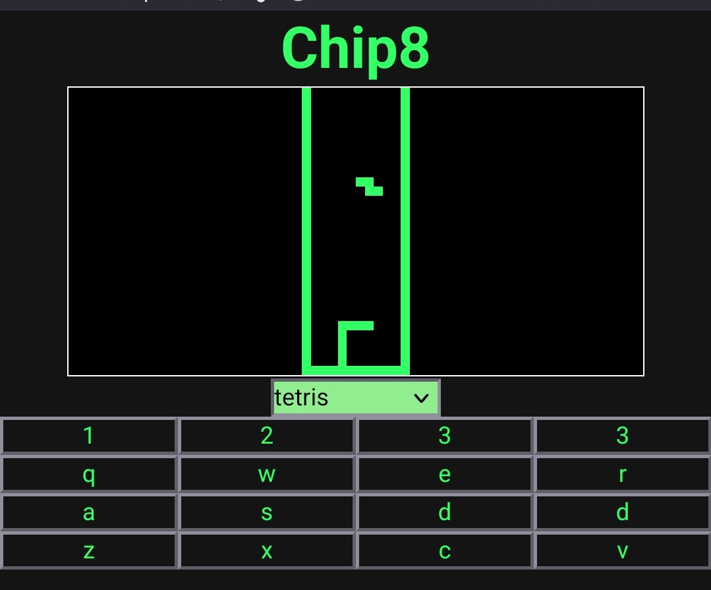

# CHIP-8 Emulator

A CHIP-8 emulator written in **TypeScript** that runs entirely in the browser. The project implements the CHIP-8 virtual machine, including its CPU, memory, display, timers, keypad input, and ROM loading.

## Features

- Complete CHIP-8 CPU implementation
- 4 KB memory and 16 general-purpose registers
- 64 × 32 monochrome display
- Hexadecimal keypad input
- Delay and sound timers
- ROM loading and execution
- Browser-based interface
- Built with TypeScript and Vite

## Screenshot





## Project Structure

```text
.
├── src/
│   ├── chip8.ts        # CPU implementation
│   ├── constants.ts    # Emulator constants
│   ├── config.ts       # Configuration
│   ├── Romdata.ts      # ROM loading
│   ├── utilities.ts    # Helper functions
│   ├── web.ts          # Rendering and input
│   ├── window.ts       # Window management
│   └── main.ts         # Entry point
├── css/
├── dist/
├── index.html
└── package.json
```

## Getting Started

### Clone the repository

```bash
git clone https://github.com/dusk-beep/chip8-js.git
cd chip8-js
```

### Install dependencies

```bash
pnpm install
```

### Start the development server

```bash
pnpm dev
```

### Build for production

```bash
pnpm build
```

## Controls

| CHIP-8 | Keyboard |
|:------:|:--------:|
| 1 | 1 |
| 2 | 2 |
| 3 | 3 |
| C | 4 |
| 4 | Q |
| 5 | W |
| 6 | E |
| D | R |
| 7 | A |
| 8 | S |
| 9 | D |
| E | F |
| A | Z |
| 0 | X |
| B | C |
| F | V |

## Implementation

The emulator implements the core components of the CHIP-8 virtual machine:

- Fetch–decode–execute CPU cycle
- Memory management
- Registers and stack
- Timers
- Sprite rendering
- Keyboard input
- ROM loading
- Collision detection

## Technologies

- TypeScript
- Vite
- HTML5 Canvas
- CSS

## References

- [Cowgod's CHIP-8 Technical Reference](http://devernay.free.fr/hacks/chip8/C8TECH10.HTM)
- [Tobias Langhoff's CHIP-8 Guide](https://tobiasvl.github.io/blog/write-a-chip-8-emulator/)
- [CHIP-8 Database](https://chip-8.github.io/database/)

## License

MIT
